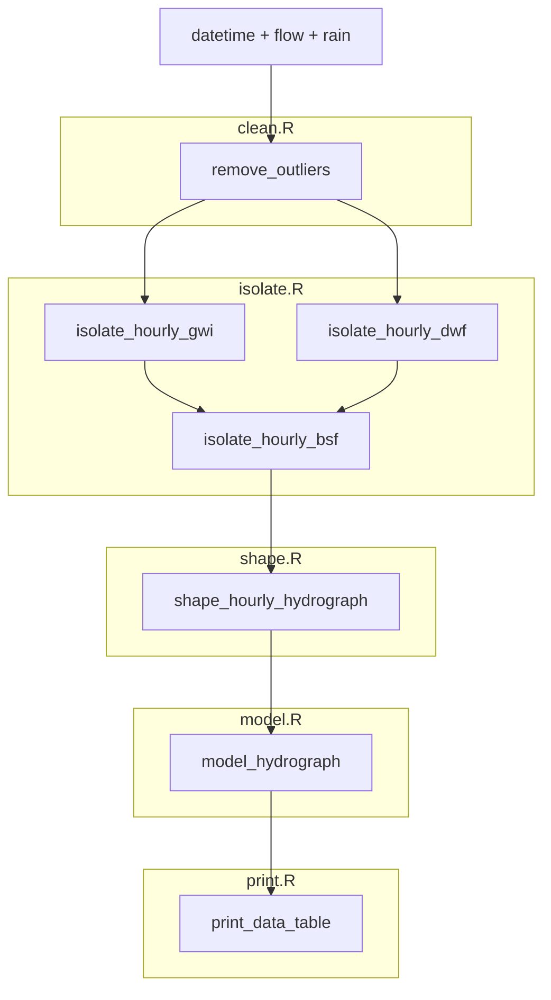
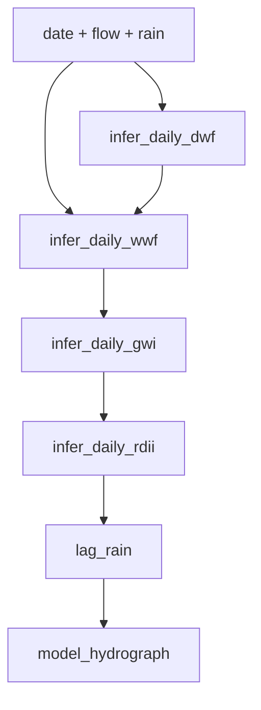
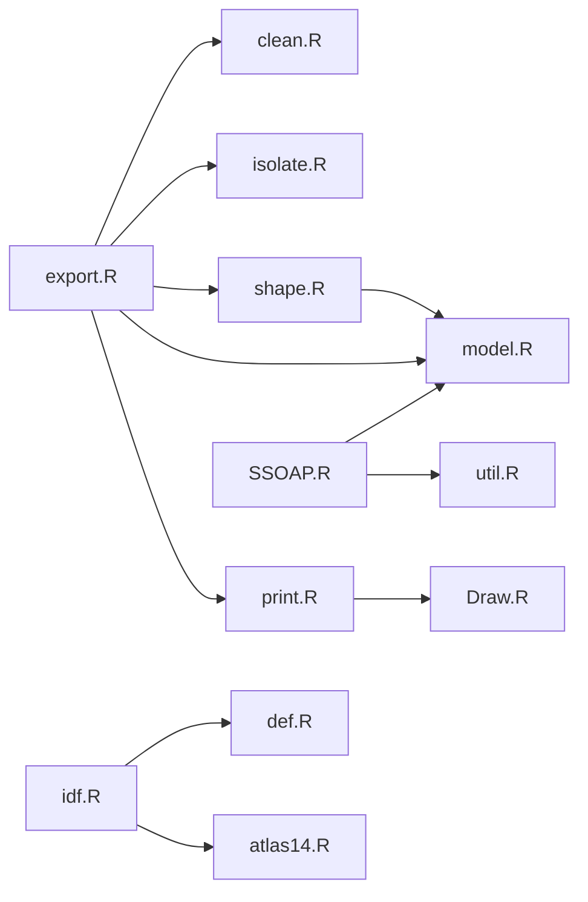

# rSSOAP Pipeline

rSSOAP decomposes raw sewer flow into three components:

> **Flow = BSF + GWI + RDI**
> - **BSF** — Base Sewer Flow (dry-weather diurnal pattern)
> - **GWI** — Groundwater Intrusion (slow groundwater baseline)
> - **RDI** — Rainfall-Derived Inflow/Infiltration (storm response)

---

## Hourly Pipeline (`export.R`)

---

## Daily Pipeline (`SSOAP.R`)

For daily resolution analysis, functions can be called individually:

---

## File Dependency Map

---

## Supporting Files

| File | Role |
|---|---|
| `clean.R` | Outlier removal and baseline correction |
| `isolate.R` | Extracts BSF, GWI, RDI components from hourly flow |
| `shape.R` | Fits unit hydrograph using VAR impulse response |
| `model.R` | Convolves rainfall matrix with unit hydrograph |
| `print.R` | Summary tables, peaking factors, model fit validation |
| `Draw.R` | Visualization — pipeline QA, QQ plots, 4-panel summaries |
| `idf.R` | Builds intensity-duration-frequency curves from hourly rain |
| `def.R` | Unit conversion constants |
| `atlas14.R` | NOAA Atlas 14 reference precipitation frequency data |
| `util.R` | Shared utilities (`lag_rain`) |
