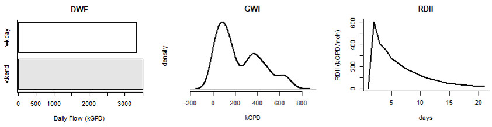

# rSSOAP

## Overview
Analysis using the [EPA SSOAP](https://www.epa.gov/water-research/sanitary-sewer-overflow-analysis-and-planning-ssoap-toolbox) toolbox typically relies on weeks or months of flow meter and rain gauge data at timesteps ranging from 15-min to 1-hr. At this resolution, data collection can be costly, time-consuming, and contain noisy measurement errors.  Instead, rSSOAP relies on long-term (1 or 2 years) of daily flow and rain gauge data.

## Installation
```
library(devtools)
devtools::install_github("dCraigJones/n185")
```

## Usage
*work in progress*


  
  
### Inputs (date, flow, rain)
  - _date_, in POSIX date format
  - _flow_, in GPD, cumulative wastewater flow
  - _rain_, in inches/day, cumulative rainfall
  
  
### Troikas (verb-adjective-noun)

#### Verb
  - _infer_, deduce flow patterns from flow and rainfall data

#### Adjective
  - _daily_, daily (24-hour) timestep

#### Nouns
  - _dwf_, Dry-Weather Flow
  - _wwf_, Wet-Weather Flow (I&I)
  - _gwi_, Groundwater Intrusion (Infiltration)
  - _rdii_, Rainfall Derived Inflow and Infiltration (Inflow)
  - _hydrograph_, unit hydrograph using data-derived SUH methods
  
### Utility Functions

*work in progress*
  

## Example Workflow

*work in progress*


## References

[1](https://www.researchgate.net/publication/287852048_Rainfall_Derived_Inflow_and_Infiltration_Modeling_Approaches) Mikalson, Daley & Guo, Yiping & J. Adams, Barry. (2012). Rainfall Derived Inflow and Infiltration Modeling Approaches. Journal of Water Management Modeling. 10.14796/JWMM.R245-08. 

[2](https://nepis.epa.gov/Adobe/PDF/P1008BBP.pdf) US EPA. (2007). Computer Tools for Sanitary Sewer System Capacity Analysis and Planning. Publication No. EPA/600/R-07/111.

## Other Packages
This package is part of a water/wastewater planning toolset.  Other packages include:

- [n185](https://www.github.com/dCraigJones/n185/), for visual fire flow analysis.
- [pumpR](https://www.github.com/dCraigJones/pumpR/), for pumpstation hydraulic analysis.
- [rSSOAP](https://www.github.com/dCraigJones/rSSOAP/), for Inflow & Infiltration Analysis.
