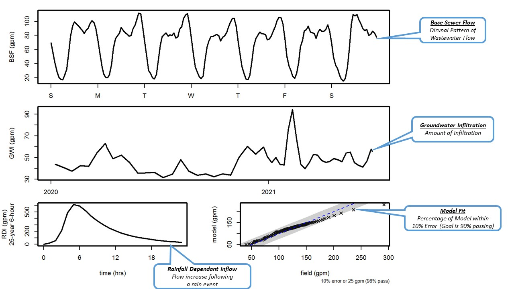
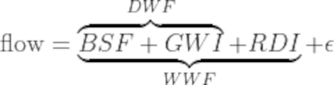
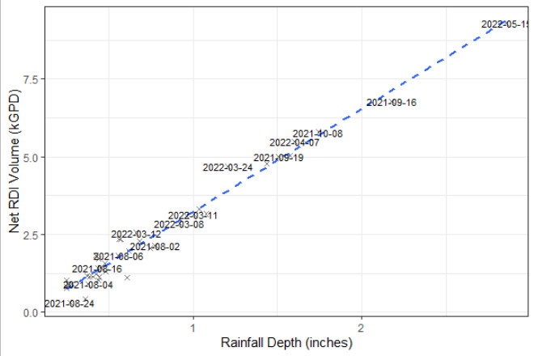
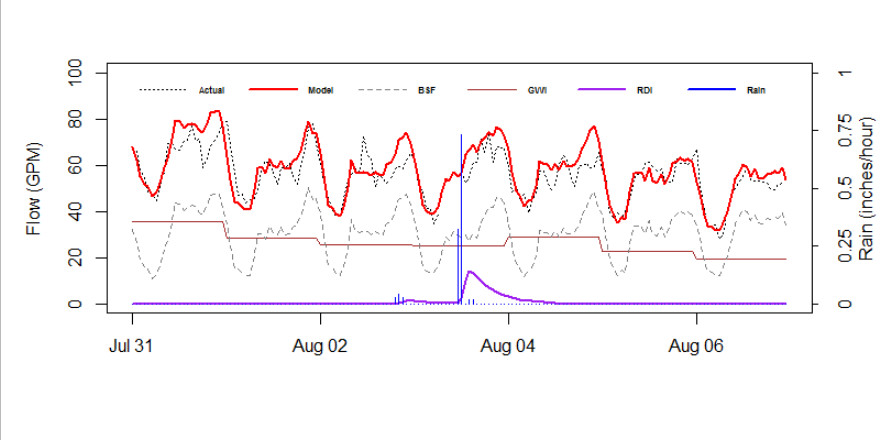
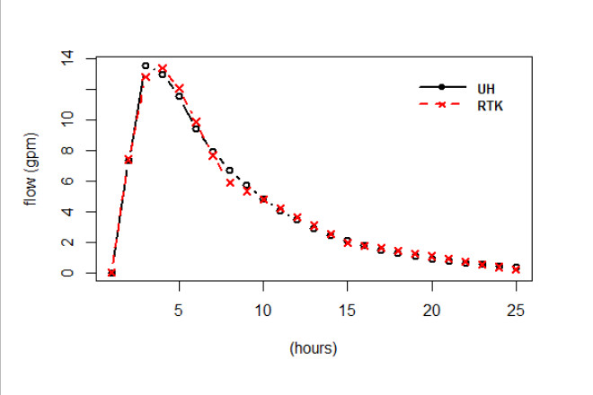

# rSSOAP

## Overview
Analysis using the [EPA SSOAP](https://www.epa.gov/water-research/sanitary-sewer-overflow-analysis-and-planning-ssoap-toolbox) toolbox typically relies on weeks or months of flow meter and rain gauge data at timesteps ranging from 5-min to 15-min. At this resolution, data collection can be costly, time-consuming, and contain noisy measurement errors.  Instead, rSSOAP relies on long-term (1 or 2 years) of hourly (or daily) flow and rain gauge data.  While less accurate, this approach is useful for developing planning-level wet-weather hydraulic models or identifying liftstation basins for further investigation.

## Installation
```
library(devtools)
devtools::install_github("dCraigJones/rSSOAP")
```



## Background

Wastewater flow patterns are a complex phenomenon that are often sub-divided into Dry-Weather Flow and Wet-Weather Flow.  **Dry-Weather Flow (DWF)** is the combination of **Base Sewer Flow (BSF)** and **Ground Water Intrustion (GWI)**.  BSF is the collected wastewater from customers that follows a predictable daily pattern in aggregate, called a diurnal.  GWI is the relatively constant flow from leaky infrasturcture during periods of high groundwater table.  **Wet-Weather Flow (WWF)** is the addition of **Rainfall Derived Inflow (RDI)** to DWF.  RDI is increased flow following rain events, usually defined by an unit hydrograph.  The final component is an error term ($\epsilon$), which includes iid noise and allows for uncertainty during special events such as holidays, abnormal weather, and mechanical issues.



In general, BSF should correspond to a percentage of water consumption.  GWI is often measured in terms of upstream gravity pipelines, in terms of GPD/IDM (or Gallons/Day per Inch-Diameter Miles).  RDI is usually measured as a percentage of total runoff.

```
##  --- Base Sewer Flow (kGPD) ----------------- 
##  Weekday:  101.8 
##  Weekend:  99.1 
##  
##  --- Peaking Factor ------------------------- 
##               min     95%     99% 
##  Weekday:    0.12    2.41    4.67 
##  Weekend:    0.12    2.44    4.66 
##  
##  --- Ground Water Infiltration (kGPD) ------- 
##  50%:  62.1 ( 29.2 gpm ) 
##  95%:  105.5 ( 73.2 gpm ) 
##  99%:  193.2 ( 134.1 gpm ) 
##  
##  --- Rainfall Derived Inflow (GPM) ---------- 
##        6-hour SCS Type-II Storm 
##      MA:  323.7 
##    5-YR:  397.5 
##   25-YR:  613.2 
##  
##  Total Volume: 59.32 kGal/inch ( 122.23 acre ) 
##  
##  --- Peak Hourly Flow (GPM) ----------------- 
##  min  (5%):  37.2 
##  DWF (95%):  243.5 
##  WWF (99%):  1,077.5 (25-YR 6-HR)
```

## Liftstation Runtime Flow
*Work in Progress*

## Rainfall

### Public Rain Gauge Data
*Work in Progress*

### Double-Mass Curve
*Work in Progress*

## I&I Model - Diagnostic Graphs
### Q-i Chart



### Event Timeseries


## Curve-Fitting RTK Parameters

<center>

| # | R | T | K |
|:-:|:-:|:-:|:-:|
| 1 | 0.001942409 | 1.6918 | 2.9759 |
| 2 | 0.002132323 | 2.8004 | 3.9940 |
| 3 | 0.003341376 | 3.7522 | 5.6965 |

</center>

## References

[1](https://www.researchgate.net/publication/287852048_Rainfall_Derived_Inflow_and_Infiltration_Modeling_Approaches) Mikalson, Daley & Guo, Yiping & J. Adams, Barry. (2012). Rainfall Derived Inflow and Infiltration Modeling Approaches. Journal of Water Management Modeling. 10.14796/JWMM.R245-08. 

[2](https://nepis.epa.gov/Adobe/PDF/P1008BBP.pdf) US EPA. (2007). Computer Tools for Sanitary Sewer System Capacity Analysis and Planning. Publication No. EPA/600/R-07/111.

[3](https://www3.epa.gov/region1/sso/pdfs/Guide4EstimatingInfiltrationInflow.pdf) US EPA. (2014). Guide for Estimating Infiltration and Inflow.

## Other Packages
This package is part of a water/wastewater planning toolset.  Other packages include:

- [n185](https://www.github.com/dCraigJones/n185/), for visual fire flow analysis.
- [pumpR](https://www.github.com/dCraigJones/pumpR/), for pumpstation hydraulic analysis.
- [rSSOAP](https://www.github.com/dCraigJones/rSSOAP/), for Inflow & Infiltration Analysis.
