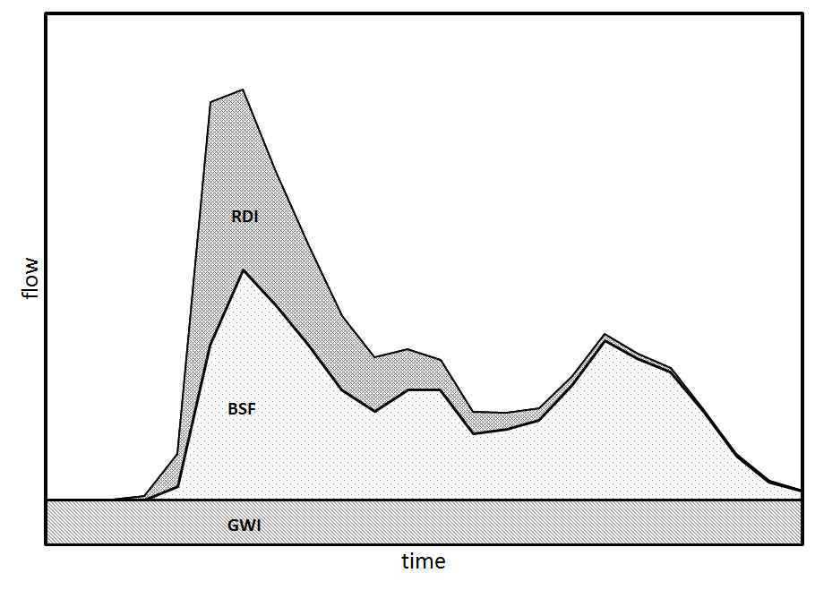
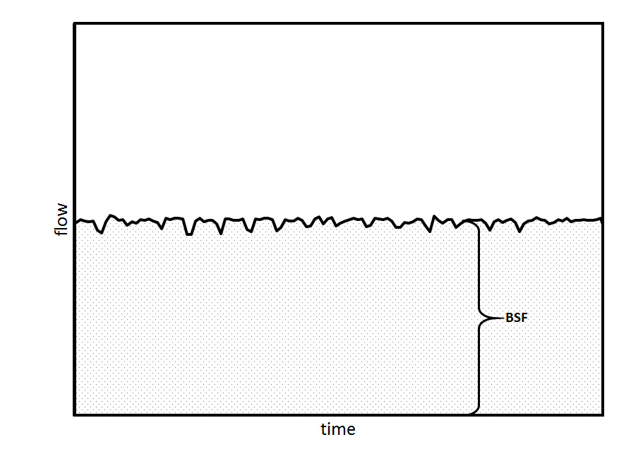
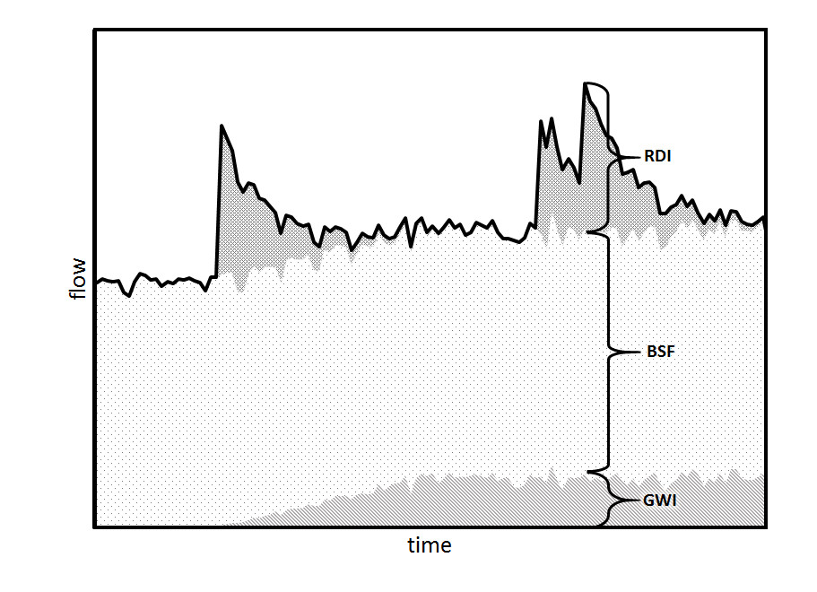
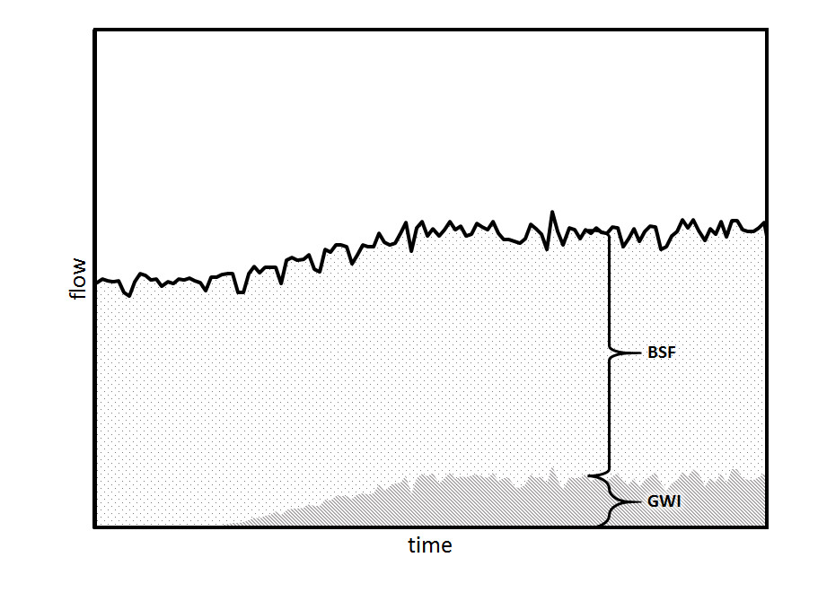
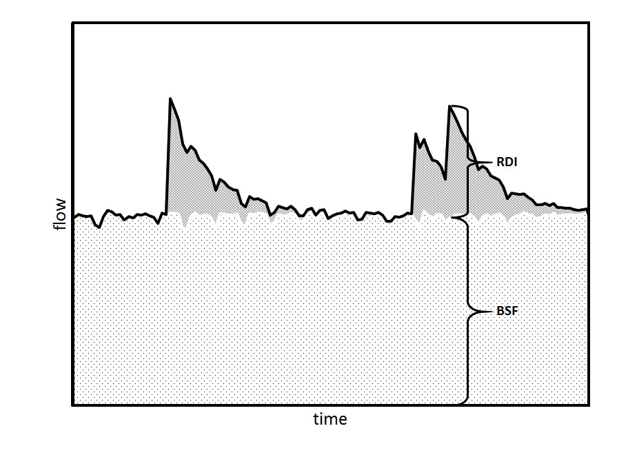

```{r setup, include = FALSE}
knitr::opts_chunk$set(
  collapse = TRUE,
  comment = "#>"
)
```

Inflow and Infiltration (I&I) are increased wastewater flows caused by intrusion of stormwater or groundwater into the sanitary sewer system.  It is correlated with wet-weather. I&I are common causes for Sanitary Sewer Overflows (SSO) and reduce available capacity for future development.  Rainwater enters the system through several mechanisms that are grouped into two primary sources of intrusion:

Leaky Infrastructure (infiltration)

  -	Fractured Pipelines and Joints
  -	Cracked Manholes
  -	Leaky connections and services
  
Direct Connections (inflow)

  -	Open Clean-outs
  -	Connected Roof Drains
  -	Vented Manhole Covers



## header here

GWI is the wet-weather flow contribution from groundwater that infiltrates the collection system through leaky infrastructure during periods of high groundwater, often following several rain events.  Increased flows from GWI can last for several weeks or months.  It is measured during periods of high groundwater when it is not raining, or during the night-time low diurnal flow periods and is quantified by the upstream gravity pipeline, for example GPD per inch Diameter per mile of pipe (GPD/in/mi or GPD/IDM).  Most design engineers report GWI as peak infiltration, which is the maximum GWI expected from the seasonal high groundwater table.

RDI is the short-term (i.e. hours or days) increase in wastewater flow following the onset of a rain event.  It is the wet-weather flow contribution from stormwater that flows into the collection system through direct connections (e.g. open clean-outs and roof-drains) and is measured during periods of high rainfall.  This study quantifies the peak RDII using the rational runoff coefficient in terms of GPD per inch of rainfall per basin acreage (GPD/in/ac).  Thus, the amount of RDII is dependent upon the intensity of the storm, such that a storm with a 5-year return will have less RDII than a storm with a 25-year return.







## Vignette Info

Note the various macros within the `vignette` section of the metadata block above. These are required in order to instruct R how to build the vignette. Note that you should change the `title` field and the `\VignetteIndexEntry` to match the title of your vignette.

## Styles

The `html_vignette` template includes a basic CSS theme. To override this theme you can specify your own CSS in the document metadata as follows:

    output: 
      rmarkdown::html_vignette:
        css: mystyles.css

## Figures

The figure sizes have been customised so that you can easily put two images side-by-side. 

```{r, fig.show='hold'}
plot(1:10)
plot(10:1)
```

You can enable figure captions by `fig_caption: yes` in YAML:

    output:
      rmarkdown::html_vignette:
        fig_caption: yes

Then you can use the chunk option `fig.cap = "Your figure caption."` in **knitr**.

## More Examples

